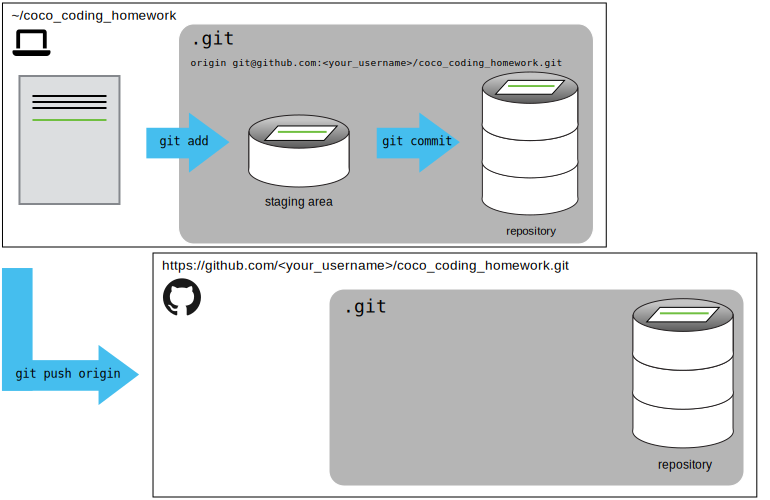

[CoCo banner](./media/coco-banner.jpg)

# Introduction to Git and GitHub | Introducción a Git y GitHub

In this lesson we will learn the basics of what Git and Github are.
You will understand what version control is and why it is important to use it.

This lesson is based on the [Version Control with
Git](https://swcarpentry.github.io/git-novice/) lesson by [Software
Carpentry](https://software-carpentry.org/).

---

En esta lección aprenderemos las bases de lo que es Git y Github.
Comprenderás qué es el control de versiones y por qué es importante usarlo.

El material de esta lección esta basado en la lección [Control de versiones con
Git](https://swcarpentry.github.io/git-novice/) de [Software
Carpentry](https://software-carpentry.org/).

## Goals | Objetivos

- Manage versions with Git | Aplicar las mejores prácticas de Git
- Apply Git best practices | Gestionar versiones con Git
- Work with remote repositories (GitHub) | Trabajar con repositorios remotos
  (GitHub)

## Contents | Contenidos

- What is Automated Version Control? | ¿Que es el Control Automatizado de
  Versiones?
- Git configuration | Configuración Git
- How to create a repository | Cómo crear un repositorio
- How to register changes | Cómo registrar cambios
- Remote repositories on GitHub | Repositorios remotos en GitHub

## Automated Version Control | Control Automatizado de Versiones

Version control keeps track of what a person did and when.

Version control systems allow us to do the same thing as in the comic but in a
more efficient, clean and orderly way.

---

El control de versiones se utiliza para realizar un seguimiento de lo que hizo
una persona y cuándo.

Los sistemas de control de versiones nos permiten hacer lo mismo que en la
historieta pero de forma mas eficiente, limpia y ordenada.


### Version control workflow | Flujo de trabajo de control de versiones

Version control systems start with a base version of the document and then
record changes you make each step of the way.
You can think of it as a recording of your progress: you can rewind to start at
the base document and play back each change you made, eventually arriving at
your more recent version.

A version control system _is a tool that keeps track of these changes for us_,
effectively creating different versions of our files.
It allows us to decide which changes will be made to the next version (each
_record of these changes is called a commit_), and keeps useful metadata about
them.
The _complete history of commits_ for a particular project and their metadata
make up a* repository*.
Repositories can be kept in sync across different computers, facilitating
collaboration among different people.

---

Los sistemas de control de versiones comienzan con una versión base del
documento y luego registran los cambios que realiza en cada paso del camino.
Puede considerarlo como la grabación de su progreso: puede rebobinar para
comenzar en el documento base y reproducir cada cambio que realizó,
llegando finalmente a su versión más reciente.

Un sistema de control de versiones _es una herramienta que realiza un
seguimiento de los cambios por nosotros_, creando diferentes versiones de
nuestros archivos.
Nos permite decidir qué cambios se guardarán en la próxima versión (cada
_registro de estos cambios se denomina commit_) y mantiene metadatos útiles
sobre los cambios guardados.
El _historial completo de cambios (commit)_ para un dado proyecto y sus
metadatos _conforman un repositorio_.
Los repositorios se pueden mantener sincronizados en diferentes computadoras,
lo que facilita la colaboración entre diferentes personas.

## Set up git | Configurando git

Set up the name with which the activity you do in `git` will be registered.
| Configuramos el nombre con el que quedará registrada la actividad que se
haga en `git`.

```
$ git config --global user.name "name"
```

Set up the email with which the activity you do in `git` will be registered.
| Configuramos el email con el que quedará registrada la actividad que se
haga en `git`.

```
$ git config --global user.email "mail"
```

Set up the text editor that `git` will use. | Configuramos el editor de
texto que `git` usará.

```
$ git config --global core.editor "text_editor"
```

## Creating a repository | Creando un repositorio

### Useful bash commands | Comandos útiles de bash

- `mkdir`: make a directory (new folder) | crea una nuevo directorio (carpeta).
- `ls`: list the files and folders in the current directory | lista los
  archivos y carpetas del directorio actual.
- `cd`: change directory | cambia de directorio.

### Git commands | Comandos de git

- `git init`: create a new repository in the current folder | crea un nuevo
  repositorio en la carpeta actual.
- `git status`: check the status of the repository | revisamos el estado del
  repositorio.

## Tracking changes | Registrando cambios

### Staging Area

If you think of `Git` as taking snapshots of changes over the life of a
project, `git add` specifies what will go in a snapshot (putting things in the
staging area), and `git commit` then actually takes the snapshot, and makes a
permanent record of it (as a `commit`) into the `.git` directory.

---

Si piensas en `Git` como tomar instantáneas de cambios durante la vida de un
proyecto, `git add` especifica qué irá en una instantánea (poniendo las cosas
en el staging area), y `git commit` entonces realmente toma la instantánea, y
genera un registro permanente de esto como un `commit` que guardara en el
directorio `.git`.

### Git command | Comandos de git

- `git add`: add one or more files to the _staging area_ | añade uno o más
  archivos al _staging area_.
- `git commit`: record changes to the _staging area_ in a commit | registra los
  cambios de la _staging area_ en un commit.
- `git log`: show a history of changes | muestra un historial de cambios.
- `git diff`: show the differences between the current state of the files and
  the most recent commit version | muestras las diferencias entre el estado
  actual de los archivos y la versión del commit más reciente.
- `git diff --staged`: show the differences between the staging of the files
  in the staging area and the version of the most recent commit | muestra las
  diferencias entre el estado de los archivos en el staging area y la versión
  del commit más reciente.


### Formative assessment 1

Which command(s) below would save changes from a modified `myfile.txt` file to the
previously created repository? | ¿Qué comandos guardarían los cambios de un
archivo modificado `myfile.txt` en el repositorio creado previamente?


1.  ```
    $ git commit -m "my recent changes"
    ```

1.  ```
    $ git init myfile.txt
    $ git commit -m "my recent changes"
    ```

1.  ```
    $ git add myfile.txt
    $ git commit -m "my recent changes"
    ```

1.  ```
    $ git commit -m myfile.txt "my recent changes"
    ```


<!-- Solution -->
<!-- 1- Would only create a commit if files have already been staged. -->
<!-- 2- Would try to create a new repository. -->
<!-- 3- Is correct: first add the file to the staging area, then commit. -->
<!-- 4- Would try to commit a file “my recent changes” with the message myfile.txt. -->

## Exploring History | Explorando el historial

### Git commands | Comandos de git

- `HEAD`: symbolizes the most recent commit | simboliza el commit más reciente.
- `git diff HEAD~2`: shows us the differences with respect to the last
  two commits | nos muestra las diferencias respecto a los últimos dos commits.
- `git show HEAD~1`: shows us the changes made by the penultimate commit | nos
  muestra los cambios realizados por el penúltimo commit.
- We can use the commit identifier instead of `HEAD` | Podemos usar el
  identificador del commit en vez de `HEAD`.
- `git checkout`: allows us to _visit_ previous commits | nos deja _visitar_
  commits anteriores.
- **Never commit if you are not in `HEAD` | Nunca hay que hacer commits si no
  estamos en `HEAD`.**


### Formative assessment 2

Jennifer has made changes to the Python script that she has been working on
for weeks, and the modifications she made this morning “broke” the script and
it no longer runs.
She has spent ~ 1hr trying to fix it, with no luck…

Luckily, she has been keeping track of her project’s versions using Git!
Which commands below will let her recover the last committed version of her
Python script called `script.py`?

---

Jennifer ha realizado cambios en el script en el que ha estado trabajando
durante semanas, y las modificaciones que hizo esta mañana “corrompieron” el
script y ya no funciona.Por suerte, ha estado usando Git.

Si Jennifer todavía no hizo ningún commit ni agregó los cambios al stage area:
¿Cuáles comandos le permitirán recuperar la última versión estable de su script
llamado `script.py`?


1.  ```
    $ git checkout HEAD
    ```

1.  ```
    $ git checkout HEAD script.py
    ```

1.  ```
    $ git checkout HEAD~1 script.py
    ```

1.  ```
    $ git checkout [ID_last_commit] script.py
    ```

1.  ```
    Both 2 and 4 | Ambas 2 y 4
    ```
    
<!-- The answer is (5)-Both 2 and 4. -->
<!---->
<!-- The checkout command restores files from the repository, overwriting the files -->
<!-- in your working directory. Answers 2 and 4 both restore the latest version in -->
<!-- the repository of the file data_cruncher.py. Answer 2 uses HEAD to indicate the -->
<!-- latest, whereas answer 4 uses the unique ID of the last commit, which is what -->
<!-- HEAD means. -->
<!---->
<!-- Answer 3 gets the version of data_cruncher.py from the commit before HEAD, -->
<!-- which is NOT what we wanted. -->
<!---->
<!-- Answer 1 can be dangerous! Without a filename, git checkout will restore all -->
<!-- files in the current directory (and all directories below it) to their state at -->
<!-- the commit specified. This command will restore data_cruncher.py to the latest -->
<!-- commit version, but it will also restore any other files that are changed to -->
<!-- that version, erasing any changes you may have made to those files! As -->
<!-- discussed above, you are left in a detached HEAD state, and you don’t want to -->
<!-- be there.  -->

## Remote repository in GitHub | Repositorio remoto en GitHub

GitHub allows us to store copies of our repositories to share them with others
or hold them as main copies.
These copies are called **remote repositories**.

---

GitHub nos permite almacenar copias de nuestros repositorios para compartirlas
con otras personas o mantenerlas como copias principales.
Estas copias se denominan **repositorio remoto**.

### Create a remote repository | Crear un repositorio remoto

Now, let's create a remote repository in our GitHub account.
So, let's go to `Repositories` page and click on the green button called `New`.

---

Ahora, creemos un repositorio remoto en nuestra cuenta de GitHub.
Entonces, vayamos a la página `Repositorios` y hagamos clic en el botón verde
llamado `Nuevo`.

**Status of our reposotory | Estado de nuestro repositorio**


### SSH setup | Configurar el SSH

Before we can connect our local repository to a remote repository, we need to
set up a way for our computer to authenticate with GitHub so it knows it’s us
trying to connect to our remote repository.

We are going to set up the method that is commonly used by many different
services to authenticate access on the command line.
This method is called **Secure Shell Protocol (SSH)**.
SSH is a cryptographic network protocol that allows secure communication
between computers using an otherwise insecure network.

SSH uses what is called a _key pair_.
This is two keys that work together to validate access.
One key is publicly known and called the _public key_, and the other key called
the _private key_ is kept private.
We use the _public key_ where we want a secure method of communication, such
as our GitHub account.

1. To create an SSH key pair, run:

   ```
   ssh-keygen -t ed25519 -C <your mail>
   ```

1. Check if GitHub can read our authentication:

   ```
   ssh -T git@github.com
   ```

1. Copy the public key:

   ```
   cat ~/.ssh/id_ed25519.pub
   ```

1. Now, going to GitHub.com, click on our profile icon in the top right corner
   to get the drop-down menu.
   Click “Settings,” then on the settings page, click “SSH and GPG keys,” on
   the left side “Account settings” menu.
   Click the “New SSH key” button on the right side.
   Now, you can add the title (for example “Lab Laptop” so we can remember
   where the original key pair files are located), paste your SSH key into the
   field, and click the “Add SSH key” to complete the setup.

1. Run again the command to check authentication:
   ```
   ssh -T git@github.com
   ```

---

Antes de que podamos conectar nuestro repositorio local a un repositorio
remoto, debemos configurar una forma para que nuestra computadora se autentique
con GitHub para que sepa que somos nosotros tratando de conectarnos a nuestro
repositorio remoto.

Vamos a configurar el método que comúnmente utilizan muchos servicios
diferentes para autenticar el acceso en la línea de comandos. Este método se
llama **Protocolo de shell seguro (SSH)**.
SSH es un protocolo de red criptográfico que permite la comunicación segura
entre computadoras que utilizan una red que de otro modo sería insegura.

SSH usa lo que se llama un _par de claves_.
Se trata de dos claves que trabajan juntas para validar el acceso.
Una clave se conoce públicamente y se denomina _clave pública_, y la otra
clave, denominada _clave privada_, se mantiene privada. Usamos la _clave
pública_ donde queremos un método seguro de comunicación, como nuestra cuenta
de GitHub.

1. Para crear un par de claves SSH, ejecutemos:

   ```
   ssh-keygen -t ed25519 -C <your mail>
   ```

1. Comprobemos si GitHub puede leer nuestra autentificación:

   ```
   ssh -T git@github.com
   ```

1. Copiemos la clave publica:

   ```
   cat ~/.ssh/id_ed25519.pub
   ```

1. Ahora, vayamos a GitHub.com, hagamos clic en nuestro ícono de perfil en la
   esquina superior derecha para obtener el menú desplegable.
   Haga clic en "Configuración", luego en la página de configuración, haga clic
   en "Claves SSH y GPG", en el menú del lado izquierdo "Configuración de la
   cuenta".
   Haga clic en el botón "Nueva clave SSH" en el lado derecho.
   Ahora, puede agregar el título (por ejemplo, "Lab Laptop" para que podamos
   recordar donde se encuentran los archivos del par de claves originales),
   pegue su clave SSH en el y haga clic en "Agregar clave SSH" para completar
   la configuración.

1. Vuelva a ejecutar el comando para verificar la autentificación:
   ```
   ssh -T git@github.com
   ```

### Push local change to a remote | Subir los cambios locales al remoto

**Status of our repository after the first `git push` | Estado de nuestro
reposotorio luego del primer `git push`:**



### Git commands | Comandos de git

- `git remote add origin <URL>`: Add a remote named `origin` for the repository
  at `URL` | Agrega el remoto llamado `origin` localizado en `URL`.
- `git remote -v`: Show all the remotes | Muestra los remotos.
- `git push origin main`: Update the remote repository | Actualiza el
  reposotorio remoto.

## Homework | Tarea

After completing this lesson, please try to create a repository.
We will use this repository to save and share future homework with the coaches
to get feedback.

1. Create in your computer a directory called `coco_coding_homework`.
1. Initialise this directory as a repository.
1. Create a file called `README.md`.
1. Add a title in the Readme file, for example: "CoCo coding homework".
   Remember to add `#` to indicate that it is a title.
   Then commit the change.
1. Add a short description of what this repository is going to be use for, for
   example: "This repo contains all the assessments proposed by the CoCo
   coding coaches.".
   Then, commit the changes.
1. Create a remote repository in your GitHub account and push your local
   changes to the remote.

---

Después de completar esta lección, intente crear un repositorio.
Usaremos este repositorio para guardar y compartir los futuros deberes los
entrenadores para obtener feedback.

1. Cree en su computadora un directorio llamado `coco_coding_homework`.
1. Inicialice este directorio como repositorio.
1. Cree un archivo llamado `README.md`.
1. Agregue un título en el archivo Readme, por ejemplo: "Tarea de programación
   de CoCo".
   Recuerda agregar `#` para indicar que es un título.
   Luego confirme (commit) el cambio.
1. Agregue una breve descripción al archivo Readme indicando para qué se
   utilizará este repositorio, por ejemplo: "Este repositorio contiene todas
   las tareas propuestas por los coding coaches de CoCo.".
   Luego, confirme (commit) los cambios.
1. Cree un repositorio remoto en su cuenta de GitHub y suba (push) su cambios
   locales en el repositorio remoto.

## Recursos para seguir aprendiendo

This lesson is base on the Software Carpentry lesson called
_[Version Control with Git](https://swcarpentry.github.io/git-novice/)_.

---

Esta lección esta basada en el material de Software Carpentry llamado
_[El Control de Versiones con Git](https://swcarpentry.github.io/git-novice-es/)_
