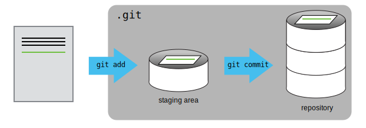
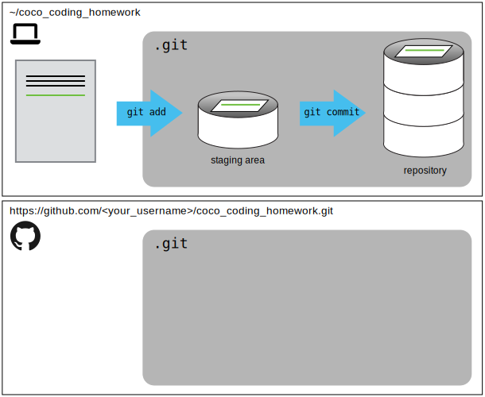

# Introduction to Git and GitHub | Introducción a Git y GitHub

In this opportunity we will learn the basics of what Git and Github are.
You will understand what version control is and why it is important to use it.

This lesson is based on the [Version Control with
Git](https://swcarpentry.github.io/git-novice/) lesson by [Software
Carpentry](https://software-carpentry.org/).

---

En esta oportunidad aprenderemos las bases de lo que es Git y Github.
Comprenderás qué es el control de versiones y por qué es importante usarlo.

El material de esta lección esta basado en la lección [Control de versiones con
Git](https://swcarpentry.github.io/git-novice/) de [Software
Carpentry](https://software-carpentry.org/).

## Goals | Objetivos

- Manage versions with Git | Aplicar las mejores prácticas de Git
- Apply Git best practices | Gestionar versiones con Git
- Work with remote repositories (GitHub) | Trabajar con repositorios remotos
  (GitHub)

## Contents | Contenidos

- What is Automated Version Control? | ¿Que es el Control Automatizado de
  Versiones?
- Git configuration | Configuración Git
- How to create a repository | Cómo crear un repositorio
- How to register the changes | Cómo registrar los cambios
- Remote repositories on GitHub | Repositorios remotos en GitHub

## Automated Version Control | Control Automatizado de Versiones

The version control can be used to keep track of what one person did and when.

Version control systems allow us to do the same thing as in the comic but in a
more efficient, clean and orderly way.

---

El control de versiones se puede utilizar para realizar un seguimiento de lo
que hizo una persona y cuándo.

Los sistemas de control de versiones nos permiten hacer lo mismo que en la
historieta pero de forma mas eficiente, limpia y ordenada.


### Version control workflow | Flujo de trabajo de control de versiones

Version control systems start with a base version of the document and then
record changes you make each step of the way.
You can think of it as a recording of your progress: you can rewind to start at
the base document and play back each change you made, eventually arriving at
your more recent version.

A version control system _is a tool that keeps track of these changes for us_,
effectively creating different versions of our files.
It allows us to decide which changes will be made to the next version (each
_record of these changes is called a commit_), and keeps useful metadata about
them.
The _complete history of commits_ for a particular project and their metadata
make up a* repository*.
Repositories can be kept in sync across different computers, facilitating
collaboration among different people.

---

Los sistemas de control de versiones comienzan con una versión base del
documento y luego registran los cambios que realiza en cada paso del camino.
Puede considerarlo como la grabación de su progreso: puede rebobinar para
comenzar en el documento base y reproducir cada cambio que realizó,
llegando finalmente a su versión más reciente.

Un sistema de control de versiones _es una herramienta que realiza un
seguimiento de los cambios por nosotros_, creando diferentes versiones de
nuestros archivos.
Nos permite decidir qué cambios se guardarán en la próxima versión (cada
_registro de estos cambios se denomina commit_) y mantiene metadatos útiles
sobre los cambios guardados.
El _historial completo de cambios (commit)_ para un dado proyecto y sus
metadatos _conforman un repositorio_.
Los repositorios se pueden mantener sincronizados en diferentes computadoras,
lo que facilita la colaboración entre diferentes personas.

### Set up git | Configurando git

Set up the name with which the activity you do in `git` will be registered.
| Configuramos el nombre con el que quedará registrada la actividad que se
haga en `git`.

```
$ git config --global user.name "name"
```

Set up the email with which the activity you do in `git` will be registered.
| Configuramos el email con el que quedará registrada la actividad que se
haga en `git`.

```
$ git config --global user.email "mail"
```

Set up the text editor that `git` will use. | Configuramos el editor de
texto que `git` usará.

```
$ git config --global core.editor "text_editor"
```

### Creating a repository | Creando un repositorio

#### Useful bash commands | Comandos útiles de bash

- `mkdir`: make a directory (new folder) | crea una nuevo directorio (carpeta).
- `ls`: list the files and folders in the current directory | lista los
  archivos y carpetas del directorio actual.
- `cd`: change directory | cambia de directorio.

#### Git commands | Comandos de git

- `git init`: create a new repository in the current folder | crea un nuevo
  repositorio en la carpeta actual.
- `git status`: check the status of the repository | revisamos el estado del
  repositorio.

### Tracking changes | Registrando cambios

#### Staging Area

If you think of `Git` as taking snapshots of changes over the life of a
project, `git add` specifies what will go in a snapshot (putting things in the
staging area), and `git commit` then actually takes the snapshot, and makes a
permanent record of it (as a `commit`) into the `.git` directory.

---

Si piensas en `Git` como tomar instantáneas de cambios durante la vida de un
proyecto, `git add` especifica qué irá en una instantánea (poniendo las cosas
en el staging area), y `git commit` entonces realmente toma la instantánea, y
genera un registro permanente de esto como un `commit` que guardara en el
directorio `.git`.



#### Git command | Comandos de git

- `git add`: add one or more files to the _staging area_ | añade uno o más
  archivos al _staging area_.
- `git commit`: record changes to the _staging area_ in a commit | registra los
  cambios de la _staging area_ en un commit.
- `git log`: show a history of changes | muestra un historial de cambios.
- `git diff`: show the differences between the current state of the files and
  the most recent commit version | muestras las diferencias entre el estado
  actual de los archivos y la versión del commit más reciente.
- `git diff --staged`: show the differences between the staging of the files
  in the staging area and the version of the most recent commit | muestra las
  diferencias entre el estado de los archivos en el staging area y la versión
  del commit más reciente.

#### Formative assessment 1

What commands would save changes from a modified `myfile.txt` file to the
previously created repository? | ¿Qué comandos guardarían los cambios de un
archivo modificado `myfile.txt` en el repositorio creado previamente?

1. option:
   ```
   $ git commit -m "my recent changes"
   ```
1. option:
   ```
   $ git init myfile.txt
   $ git commit -m "my recent changes"
   ```
1. option:
   ```
   $ git add myfile.txt
   $ git commit -m "my recent changes"
   ```
1. option:
   ```
   $ git commit -m myfile.txt "my recent changes">
   ```

<!-- Solution -->
<!-- 1- Would only create a commit if files have already been staged. -->
<!-- 2- Would try to create a new repository. -->
<!-- 3- Is correct: first add the file to the staging area, then commit. -->
<!-- 4- Would try to commit a file “my recent changes” with the message myfile.txt. -->

### Exploring History | Explorando el historial


#### Git commands | Comandos de git

- `HEAD`: symbolizes the most recent commit | simboliza el commit más reciente.
- `git diff HEAD~2`: shows us the differences with respect to the last
  two commits | nos muestra las diferencias respecto a los últimos dos commits.
- `git show HEAD~1`: shows us the changes made by the penultimate commit | nos
  muestra los cambios realizados por el penúltimo commit.
- We can use the commit identifier instead of `HEAD` | Podemos usar el
  identificador del commit en vez de `HEAD`.
- `git checkout`: allows us to _visit_ previous commits | nos deja _visitar_
  commits anteriores.
- **Never commit if you are not in `HEAD` | Nunca hay que hacer commits si no
  estamos en `HEAD`.**

#### Formative assessment 2

Jennifer has made changes to the Python script that she has been working on
for weeks, and the modifications she made this morning “broke” the script and
it no longer runs.
She has spent ~ 1hr trying to fix it, with no luck…

Luckily, she has been keeping track of her project’s versions using Git!
Which commands below will let her recover the last committed version of her
Python script called `script.py`?

---

Jennifer ha realizado cambios en el script en el que ha estado trabajando
durante semanas, y las modificaciones que hizo esta mañana “corrompieron” el
script y ya no funciona.
Por suerte, ha estado usando Git.

Si Jennifer todavía no hizo ningún commit ni agrego los cambios al stage area:
¿Cuáles comandos le permitirán recuperar la última versión estable de su script
llamado `script.py`?

1. option:
   ```
   $ git checkout HEAD
   ```
2. option:
   ```
   $ git checkout HEAD script.py
   ```
3. option:
   ```
   $ git checkout HEAD~1 script.py
   ```
4. option:
   ```
   $ git checkout [ID_last_commit] script.py
   ```
5. Both 2 and 4 | Ambas 2 y 4

<!-- The answer is (5)-Both 2 and 4. -->
<!---->
<!-- The checkout command restores files from the repository, overwriting the files -->
<!-- in your working directory. Answers 2 and 4 both restore the latest version in -->
<!-- the repository of the file data_cruncher.py. Answer 2 uses HEAD to indicate the -->
<!-- latest, whereas answer 4 uses the unique ID of the last commit, which is what -->
<!-- HEAD means. -->
<!---->
<!-- Answer 3 gets the version of data_cruncher.py from the commit before HEAD, -->
<!-- which is NOT what we wanted. -->
<!---->
<!-- Answer 1 can be dangerous! Without a filename, git checkout will restore all -->
<!-- files in the current directory (and all directories below it) to their state at -->
<!-- the commit specified. This command will restore data_cruncher.py to the latest -->
<!-- commit version, but it will also restore any other files that are changed to -->
<!-- that version, erasing any changes you may have made to those files! As -->
<!-- discussed above, you are left in a detached HEAD state, and you don’t want to -->
<!-- be there.  -->

### Remotes in GitHub | Repositorio remoto in GitHub

**Estado de nuestro repostorio local**


**Estado de nuesto**



**Luego del primer `git push`:**


