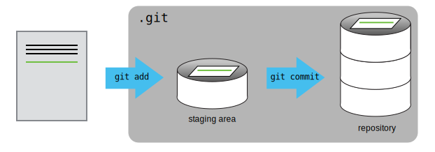
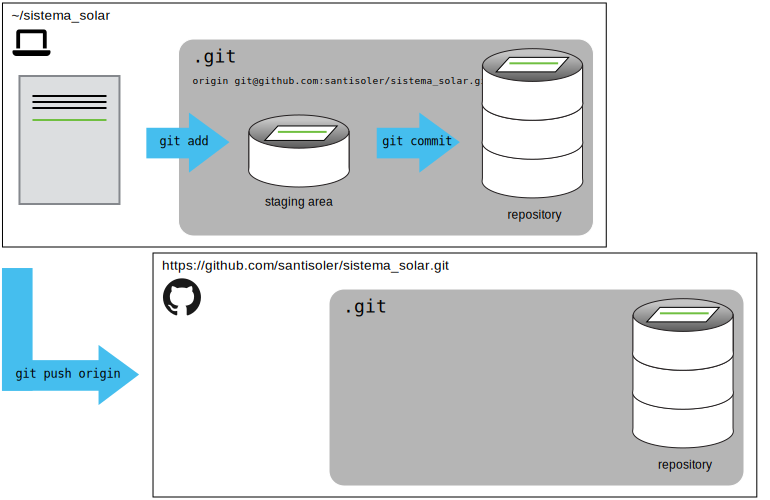
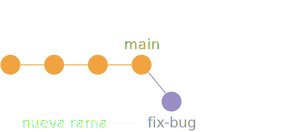
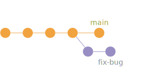
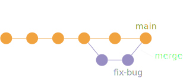

# Working with branches | Trabajando con ramas

## What we know | Qué sabemos

- We know how to work with the `main` (master) branch. | Sabemos como trabajar
  en la rama `main` (master).

- Changes are saved in the repository as _commits_. | Los cambios se guardan
  en el repositorio como _commits_ (`git add` y `git commit`).
  

- We know how to create _remote_ repositories in GitHub and link them with the
  local repositories usng `git push` and `git pull`. | Sabemos cómo crear
  repositorios _remote_ en GitHub y vincularlos con los repositorios locales
  usando `git push` y `git pull`.
  

## What we will learn | Qué aprenderemos

_git_ is at its best when we start working with **branches** within our
repository.

---

El máximo esplendor de _git_ se obtiene cuando empezamos a trabajar con
**ramas** dentro de nuestro repositorio.

## What is a branch and how do we work with it? | ¿Qué es una rama y cómo trabajamos con ella?

Branches are one of the core concepts in _git_ and there's an endless amount of
things you can do with them.
One of the most important functions of _git_ is the control of branches to
achieve a better development of our project.
The _branches_ help us have multiple versions of a project in an organized
format.

In general, a new branch is a bifurcation of the current project that creates
a new path for the evolution of it.
It is a good way to incorporate new functionalities to our code/project in an
orderly and precise way.

---

Las ramas son uno de los conceptos centrales en _git_ y hay un sinfín de cosas
que puedes hacer con ellas.
Una de las funciones más importantes de _git_ es el control de las ramas para
lograr un mejor desarrollo de nuestro projecto.
Las _ramas_ nos ayudan a tener múltiples versiones de un mismo proyecto
organizado.

En general, una nueva rama es una bifurcación del estado de proyecto que crea
un nuevo camino para la evolución del mismo.
Es una buena manera de incorporar nuevas funcionalidades a nuestro
código/proyecto de forma ordenada y precisa

For example, suppose our repository has 4 commits on the `main` branch: |
Por ejemplo, supongamos que nuestro repositorio tiene 4 commits en la rama
`main`:


Then we find a bug in our code/project and we want to fix it, but we are not
sure how.
So, we create a new branch (`fix-bug`) to try different ways to fix it.

---

Luego encontramos un error en nuestro código/proyecto y queremos corregirlo,
pero no estamos seguros de cómo hacerlo.
Entonces, creamos una nueva rama (`fix-bug`) para probar diferentes formas de
solucionarlo.


In this new branch, we made several commits to fix bug.
At the same time, we made other commits in the `main` branch.

---

En esta nueva rama, hacimos varios commits para corregir el error.
Al mismo tiempo, hicimos otros commits en la rama `main`.


Now that we could fix the bug in the `fix-bug` branch, we want to add these
commits to the `main` branch using the `git merge` command.

---

Ahora que pudimos arreglar el error en la rama `fix-bug`, queremos agregar
estos commits a la rama `main` usando el comando `git merge`:


### Advantages of using branches | Ventajas de usar ramas

Using _git branches_ has multiple advantages.
However, we want to emphasize the following two:

- It is possible to develop new features/changes in our project without
  hindering the development in the main branch.

- It is possible to create different development branches that can converge
  in the same repository.
  **For example, a stable branch (`main`), a test branch (`test`), and a
  `fix-bug` branch**.

---

Usar _ramas de git_ tiene múltiples ventajas.
No obstante, queremos destacar solo estas 2:

- Es posible desarrollar nuevas funciones/modificaciones a nuestro proyecto sin
  obstaculizar el desarrollo en la rama principal.

- Es posible crear diferentes ramas que pueden converger en un mismo
  repositorio.
  **Por ejemplo, una rama estable (`main`), una rama de prueba (`test`) y una
  rama de `fig-bug`**.

## How to create a new branch | Cómo crear una nueva rama

In any _git repository_ we can view all branches by entering the following
command: | En cualquier _repositorio de git_ podemos ver todas las ramas
ingresando el siguiente comando:

```
git branch
```

This command lists all the branches and puts a `*` in the name of the branch
that we are currently located to make the changes.

---

Este comando enumera todas las ramas y coloca un `*` en el nombre de la rama en
la que nos encontramos localizados en este momento para realizar los cambios.

Creating a branch is really simple: | Crear una rama es muy simple:

```
$ git branch <new-branch-name>
```

Next, we need to move to the newly created branch, so run the following
command: | Luego, debemos movernos a la rama recién creada, con el siguiente
comando:

```
$ git checkout <new-branch-name>
```

or | o

```
$ git swich <new-branch-name>
```

The output will inform us that we switched to a new branch called
`<new-branch-name>`. | La salida nos informará que cambiamos a una nueva rama
llamada `<new-branch-name>`.

```
Switched to branch ‘<new-branch-name>’
```

Now, in that new branch, we can create as many modifications as we want without
having to change anything in the `main` branch.
As we can see, it keeps the project organized for new modifications inclusions.

If we run the command to list the branches again (`git branch`), we will see
that a new branch was added and that we are located in it.

---

Ahora, en esa nueva rama, podemos crear tantas modificaciones como queramos
sin tener que cambiar nada en la rama `main`.
Como podemos ver, esto mantiene el proyecto organizado para la inclusión de
nuevas modificaciones.

Si ejecutamos de nuevo el comando para listar las ramas (`git branch`), veremos
que se agregó la nueva rama y que estamos ubicados en ella.

To check which branch we are, use the command `git status` and read the output:
| Para verificar dónde estamos, usamos el comando `git status` . El resultado
será:

```
$ git status

In the branch <new-branch-name>
Your branch is up to date with 'origin/<new-branch-name>'.
```

---

```
$ git status

En la rama <nombre-nueva-sucursal>
Tu rama está actualizada con 'origin/<new-branch-name>'.
```

### How to rename a branch | Cómo renombrar una rama

Mistyping a branch's name or simply changing our mind after the fact is all
too easy.
That's why _git_ makes it pretty easy to rename a local branch.

---

Escribir mal el nombre de una rama o simplemente cambiar de opinión sobre su
nombre después de crearla es algo común.
Es por eso que _git_ nos permit cambiar el nombre de una rama local fácilmente.

If we want to rename your current branch, we can use the following command: |
Si deseamos cambiar el nombre de su rama actual, puede usar el siguiente
comando:

```
$ git branch -m <new-name>
```

In case we'd like to rename a different local branch (which is NOT currently
checked out), we'll have to provide the old and the new name:

---

En caso de que deseeamos cambiar el nombre de una rama local (diferente a la
que actualmente estamos localizados), debemos proporcionar el nombre antiguo y
el nuevo:

```
$ git branch -m <old-name> <new-name>
```

These commands, again, are used to work with local branches. | Estos comandos,
de nuevo, se utilizan para trabajar con ramas locales.

---

## How to merge a branch? | Cómo fusionar ramas

### In a local machine | En una máquina local

Finally, there comes a point where we have made many modifications to a
`<new-branch-name>` branch.
So we want to add all these modifications to the `main` branch.
For that, we use the `git merge` command.

---

Finalmente, llega un punto en el que hemos hecho muchas modificaciones a la
rama `<new-branch-name>`.
Entonces queremos fusionar estos cambios a la rama `main`.
Para eso, existe el comando `git merge`.

We will attach the `<new-branch-name>` branch to the `main` branch.
First, we have to place ourselves in the `main` branch: | Fusionaremos la rama
`<new-branch-name>` a la rama `main`.
Primero, tenemos que situarnos en la rama `main`:

```
$ git swich main
```

Then, we merge the branches with: | Luego, fusionamos las ramas con:

```
git merge <new-branch-name>
```

Now, all the modification we made in <new-branch-name> are in the main branch.
Using the command `git log`, we can see the commits.

---

Ahora, todas las modificaciones realizadas en `<new-branch-name>` están en la
rama `main`.
Usando el comando `git log`, podemos ver los commits.

---

### Using GitHub | Usando GitHub

Another way to marge a branch to `main` is using the _Pull Request_ in the
GitHub interface.
This workflow has some advantages:

- It is more visual
- You can ask review or opinion of your modifications before merge it to main.
- It has some tools that help you not to make a mistake.

---

Otra forma de fusionar una rama a la rama `main` es usado _Pull Request_ en la
interfaz de GitHub.
Este flujo de trabajo tiene algunas ventajas:

- Es más visual.
- Puedes solicitar una revisión u opinión de tus modificaciones antes de
  fusionarlas con la rama principal.
- Tiene algunas herramientas que te ayudan a no equivocarte.

## How to delete a branch | Como eliminar una rama

Not all branches are meant to live forever.
In fact, most branches in any repository will be short-lived.
So if we want to do a little housecleaning, the command to delete a local
branch is:

---

No todas las ramas están destinadas a vivir para siempre.
De hecho, la mayoría de las ramas en cualquier repositorio serán de corta
duración.
Entonces, si se desea hacer una pequeña limpieza, el comando par eliminar una
rama de nuesto repositorio local es:

```
$ git branch -d <branch-name>
```

## How to track branches | Como traquear ramas

By default, local and remote branches have nothing to do with each other.
They are stored and managed as independent objects in _git_.
But in real life, of course, local and remote branches often do have a
relationship with each other.
**Such a relationship can be modelled in _git_: one branch (typically a local
one) can "track" another one (typically remote)**.

---

Por default, las ramas locales y remotas no tienen nada que ver entre sí,
debido a que se almacenan y administran como objetos independientes en _git_.
Pero en la vida real, por supuesto, las ramas locales y remotas a menudo
tienen un relación entre sí.
**Tal relación se puede modelar en _git_: una rama (típicamente local) puede
"rastrear" a otra (típicamente remota)**.

Therefore, to track a remote branch: | Por lo tanto, para rastrear una rama remota:

```
$ git push --set-upstream origin <new-branch-name>
```

Once such a tracking relationship has been established, a couple of things will
become a lot easier: most notably, when pushing or pulling.

---

Una vez que se haya establecido dicha relación de seguimiento, las acciones de
push and pull serán mucho más fáciles.
