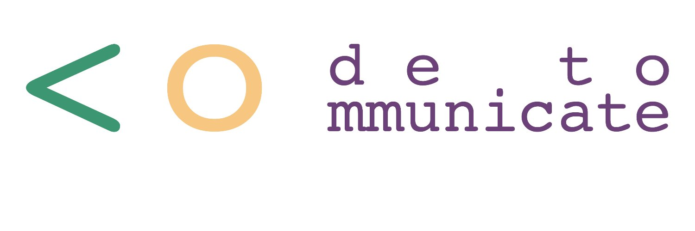

# Material for the Coding lesson | Material para las lecciones de coding

This repository contains the material that we will use in the coding lessons to
learn about Bash, Git/GitHub and Python.

---

Este repositorio contiene el material que se usará en las lecciones de coding
para aprender sobre Bash, Git/GitHub y Python.

## Schedule | Cronograma

| Week | Material                                                                    | Topics                                                                                                       |
| ---- | --------------------------------------------------------------------------- | ------------------------------------------------------------------------------------------------------------ |
| 1°   | Setting up a scientific coding environment                                  | Install software - Login to a JupyterHub - Get familiar with JupyterLab and Jupyter Notebook                 |
| 2°   | The shell                                                                   | What is a command shell and why would I use one? - Files, directories and locations                          |
| 3°   | Start to work with Git: from configuration to create a repository in GitHub | What is? - Set up - How to use it?                                                                           |
| 4°   | Introduction to Python and Numpy                                            | Variables - Types of data and structures - Numpy arrays                                                      |
| 5°   | Data visualization with matplotlib                                          | How can we open a file? - How can we plot our data? - Plots types - How can we save our plot for publishing? |
| 6°   | More about Python                                                           | For loops - Conditional statements - Write our own functions                                                 |
| 7°   | Pandas                                                                      | How to create and store a DataFrame - How to open a file - Some way to work with a DataFrame - Plots         |
| 8°   | Collaborative work with Git                                                 | How to work collaboratively - Solve conflicts                                                                |
| 9°   | Geo-package                                                                 |                                                                                                              |
| 10°  | Geo-package                                                                 |                                                                                                              |

## Requirements | Requisitos

- Personal computer with internet connection and browser.
- It isn't necessary to have a camera and microphone, although it would be
  beneficial to exchange ideas.
- It is not necessary to have programming knowledge.
- Have your scientific coding environment configurated.

---

- Computadora personal con conexión a internet y navegador.
- No es necesario tener cámara y micrófono, aunque sería beneficioso para poder
  intercambiar ideas.
- No es necesario tener conocimientos de programación.
- Tener configutado tu entorno para programación cienttífica.

## The CSDMS JupyterHub

The [Community Surface Dynamics Modeling System][csdms] (CSDMS)
provides a JupyterHub where the notebooks in this repository can be run.
Click this button [![Run on CSDMS JupyterHub][badge]][nbgitpuller-link]
to open this repository directly on the CSDMS JupyterHub!

## License | Licencia

[![CC BY 4.0][cc-by-image]][cc-by]

All Code to Communicate (CoCo) instructional material is made available under
the [Creative Commons Attribution 4.0 International License][cc-by].

## Acknowledgment | Reconocimiento

Code to Communicate is supported by the National Science Foundation
under Award Nos. [2118272][nsf-award-nicole], [2117519][nsf-award-julie], and
[2118171][nsf-award-mark],
_Collaborative Research: CyberTraining: Pilot: A Cybertraining Program to
Advance Knowledge and Equity in the Geosciences_.

Portions of the Code to Communicate setup and shell lessons
are derived from material that is copyright
[Software Carpentry][swc]
and remixed under their [license][swc-license].

<!-- Links -->

[badge]: https://img.shields.io/badge/CSDMS-JupyterHub-orange.svg
[cc-by]: http://creativecommons.org/licenses/by/4.0/
[cc-by-image]: https://i.creativecommons.org/l/by/4.0/88x31.png
[csdms]: https://csdms.colorado.edu
[nbgitpuller-link]: https://lab.openearthscape.org/hub/user-redirect/git-pull?repo=https%3A%2F%2Fgithub.com%2FCodeToCommunicate%2FCoCoLessons&urlpath=lab%2Ftree%2FCoCoLessons%2F%3Fautodecode&branch=main
[notebook]: ./lessons/jupyter/general_jupyter_notebook_tutorial.ipynb
[nsf-award-nicole]: https://www.nsf.gov/awardsearch/showAward?AWD_ID=2118272
[nsf-award-julie]: https://www.nsf.gov/awardsearch/showAward?AWD_ID=2117519
[nsf-award-mark]: https://www.nsf.gov/awardsearch/showAward?AWD_ID=2118171
[swc]: http://software-carpentry.org
[swc-license]: https://github.com/swcarpentry/python-novice-inflammation/blob/gh-pages/LICENSE.md
[swc]: http://software-carpentry.org
[swc-license]: https://github.com/swcarpentry/python-novice-inflammation/blob/gh-pages/LICENSE.md
